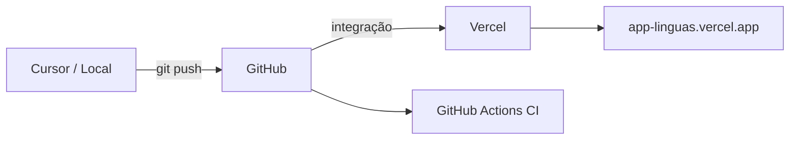

# Deploy — GitHub + Vercel

Guia para publicar a versão **web** do Línguas Kids na Vercel, com código no GitHub.

## Visão geral



| Serviço | Função |
|---------|--------|
| **GitHub** | Repositório, issues, PRs, CI |
| **Vercel** | Hospedagem web (HTTPS, preview por PR) |
| **Expo** | Build web estático (`dist/`) |

---

## 1. Criar repositório no GitHub

### Opção A — Pelo site

1. Acesse [github.com/new](https://github.com/new)
2. Nome sugerido: `app-linguas` ou `linguas-kids`
3. **Não** marque README (já existe no projeto)
4. Crie o repositório

### Opção B — Pelo terminal (GitHub CLI)

```bash
gh auth login
gh repo create app-linguas --public --source=. --remote=origin
```

---

## 2. Enviar código para o GitHub

Na pasta do projeto:

```bash
git init
git add .
git commit -m "Initial commit: Línguas Kids web + mobile"
git branch -M main
git remote add origin https://github.com/SEU_USUARIO/app-linguas.git
git push -u origin main
```

Substitua `SEU_USUARIO` pelo seu usuário do GitHub.

---

## 3. Conectar na Vercel

1. Acesse [vercel.com](https://vercel.com) e faça login (use **Continue with GitHub**)
2. **Add New → Project**
3. Importe o repositório `app-linguas`
4. A Vercel detecta `vercel.json` automaticamente:

| Campo | Valor |
|-------|-------|
| Framework Preset | Other |
| Build Command | `npm run build:web` |
| Output Directory | `dist` |
| Install Command | `npm install` |

5. Clique **Deploy**

Após ~2 minutos você terá uma URL como `https://app-linguas.vercel.app`.

### Preview por Pull Request

Cada PR no GitHub gera um link de preview na Vercel — útil para testar antes de mergear.

---

## 4. Variáveis de ambiente (Vercel)

Quando integrar APIs (ex.: Azure Speech):

1. Vercel → Project → **Settings → Environment Variables**
2. Adicione as variáveis de `.env.example`
3. Prefixo `EXPO_PUBLIC_` expõe valores no client Expo (use só o que for seguro)

---

## 5. CI no GitHub Actions

O workflow `.github/workflows/ci.yml` roda em todo push/PR na branch `main`:

- Instala dependências
- `npm run typecheck`
- `npm run build:web`

Veja o status em **Actions** no GitHub.

---

## 6. Domínio personalizado (opcional)

1. Vercel → Project → **Settings → Domains**
2. Adicione ex.: `linguaskids.com.br`
3. Configure DNS conforme instruções da Vercel

---

## Mobile (fora da Vercel)

A Vercel hospeda só a **versão web**. Para Android/iOS:

- [Expo EAS Build](https://docs.expo.dev/build/introduction/)
- Ou continue testando com **Expo Go**

---

## Comandos úteis

```bash
# Desenvolvimento local
npm start
npm run web

# Simular build da Vercel
npm run build:web

# Verificar tipos
npm run typecheck
```

---

## Troubleshooting

| Problema | Solução |
|----------|---------|
| Build falha na Vercel | Rode `npm run build:web` localmente e corrija erros |
| Microfone não funciona | HTTPS é obrigatório (Vercel já fornece) |
| Rota 404 ao recarregar | `vercel.json` já inclui rewrites para SPA |
| CI falha | Veja logs em GitHub → Actions |
